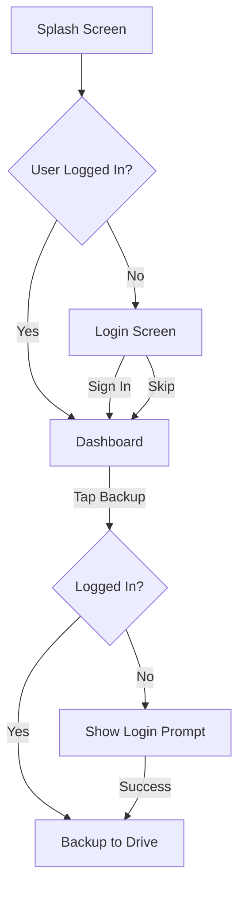

<div align="center">
  
  <h1>💰 Amar Savings</h1>
  <p><strong>Track Physical Cash Savings • Built for Bangladeshi Currency • Offline-First</strong></p>

  <p>
    
    
    
    
    
  </p>

  <p>
    
    
    
    
    
    
  </p>
</div>

---

## 📋 Table of Contents

- [About](#-about-amar-savings)
- [Screenshots](#-screenshots)
- [Key Features](#-key-features)
- [How It Works](#-how-it-works)
- [Supported Denomination Notes](#-supported-denomination-notes)
- [Screens](#-screens)
- [Technical Stack](#-technical-stack)
- [Authentication & Backup Flow](#-authentication--backup-flow)
- [What's NOT Included](#-whats-not-included-by-design)
- [Getting Started](#-getting-started)
- [Project Structure](#-project-structure)
- [Roadmap](#-roadmap)
- [Contributing](#-contributing)
- [Code of Conduct](#-code-of-conduct)
- [Security](#-security)
- [Support](#-support)
- [Changelog](#-changelog)
- [License](#-license)
- [Acknowledgments](#-acknowledgments)

---

## 📱 About Amar Savings

**Amar Savings** is a simple, elegant, and offline-first personal savings tracker designed specifically for monitoring **physical cash savings** using **Bangladeshi currency notes** (Taka).

> **"Track physical savings with the fewest possible taps."**

Every feature is built around this core principle. No clutter. No complexity. Just a reliable tool that helps you stay on top of your savings goals.

Built with **Kotlin**, **Jetpack Compose**, **Material 3**, and **Room**, the app follows the **MVVM** architecture with **Koin** for dependency injection, **Coroutines** + **Flow** for asynchronous work, and **Navigation Compose** for in-app routing.

---

## 📸 Screenshots

> **Screenshots will be added here once the UI is finalised.** Placeholder images
> will live under `docs/screenshots/` and be embedded like:
>
> ```markdown
> 
> ```

If you'd like to contribute screenshots, please open a pull request adding the
images to `docs/screenshots/` and embedding them above.

---

## ✨ Key Features

| Feature                         | Description                                                         |
|---------------------------------|---------------------------------------------------------------------|
| 🏦 **Denomination-Based Input** | Add/withdraw cash by entering note quantities (1 to 1000 Taka)      |
| 🎯 **Savings Goal Tracking**    | Set a target amount and watch your progress                         |
| 📊 **Real-Time Dashboard**      | See savings overview, progress, and recent transactions at a glance |
| 🔄 **Offline-First**            | Full functionality without internet connection                      |
| ☁️ **Google Drive Backup**      | Optional cloud backup to keep your data safe                        |
| 📜 **Transaction History**      | View, edit, or delete past entries                                  |
| 🎨 **Adaptive Theme**           | Follows your device's dark/light mode automatically                 |

---

## 🚀 How It Works

### 💸 Adding Savings (Cash In)

1. Tap the **Floating Action Button (FAB)**
2. Enter quantities for each denomination you're adding
3. Total calculates automatically
4. Tap **"Add"** → Entry saved

**Example:** `5 × ৳1000 + 2 × ৳500 = ৳6,000 added`

### 💰 Withdrawing Savings (Cash Out)

1. **Long-press** the FAB → Select "Cash Out"
2. Enter quantities being removed
3. Tap **"Withdraw"** → Negative entry saved

### 🎯 Setting a Savings Goal

- Tap the **Goal Card** on Dashboard
- Enter your target amount (e.g., ৳100,000)
- Watch progress update in real-time

### ☁️ Backup & Restore

- **Manual Backup:** Tap "Back up now" in Settings → Backup section (requires Google Sign-In)
- **Automatic Backup:** Happens in background when logged in
- **Restore:** Open Settings → Backup → "Restore from Drive". Shows a confirmation dialog before replacing local data.

---

## 🗂️ Supported Denomination Notes

<div align="center">

| Denomination |    Input Field    |
|:------------:|:-----------------:|
|    ৳1000     | [Quantity] × 1000 |
|     ৳500     | [Quantity] × 500  |
|     ৳200     | [Quantity] × 200  |
|     ৳100     | [Quantity] × 100  |
|     ৳50      |  [Quantity] × 50  |
|     ৳20      |  [Quantity] × 20  |
|     ৳10      |  [Quantity] × 10  |
|      ৳5      |  [Quantity] × 5   |
|      ৳2      |  [Quantity] × 2   |
|      ৳1      |  [Quantity] × 1   |

</div>

---

## 📱 Screens

### Splash Screen
- Standard Android SplashScreen API
- Dismisses instantly when data is ready
- **No artificial delays**

### Login Screen
- "Sign in with Google" button
- "Skip" option for offline-only use
- Authentication only required for backup

### Dashboard (Main Screen)
- Savings Overview (Current / Goal / Remaining)
- Goal Card (tap to edit)
- Progress Bar
- Cash Analytics (total notes + distribution)
- Backup Section with timestamp
- Recent Transactions (last 5 entries)
- Floating Action Button

### History Screen
- Complete transaction list
- Date & Time • Type • Denomination Breakdown • Total Amount
- Swipe to delete • Tap to edit

### Settings Screen
- **Account section** — current sign-in profile, or "Sign in with Google" CTA when signed out, plus Sign Out
- **Backup section** — "Google Drive" status row, "Back up now" action (debounced with an automatic backup indicator), and "Restore from Drive" action (always confirms before replacing local data)
- **Appearance section** — explicit theme toggle (Light / Dark / Follow system) so users can override the default adaptive theme
- **About section** — app name and version

---

## 🏗️ Technical Stack

<div align="center">

| Component        | Technology                       |
|------------------|----------------------------------|
| **Language**     | Kotlin                           |
| **UI Toolkit**   | Jetpack Compose (Material 3)     |
| **Architecture** | MVVM                             |
| **DI**           | Koin                             |
| **Local DB**     | Room                             |
| **Preferences**  | DataStore                        |
| **Backup**       | Google Drive API + Google Sign-In |
| **Concurrency**  | Coroutines + Flow                |
| **Navigation**   | Navigation Compose               |
| **Build System** | Gradle 8.x with version catalog  |

</div>

### Key Versions

| Library                  | Version  |
|--------------------------|----------|
| Android Gradle Plugin    | `8.13.2` |
| Kotlin                   | `2.0.21` |
| Compose BOM              | `2025.05.00` |
| Room                     | `2.7.1`  |
| Koin                     | `4.0.4`  |
| Navigation Compose       | `2.9.0`  |
| DataStore Preferences    | `1.1.4`  |
| compileSdk / targetSdk   | `36`     |
| minSdk                   | `24`     |

---

## 🔐 Authentication & Backup Flow



---

## ❌ What's NOT Included (By Design)

- No Activity/Audit Log Tab
- No Goal Deadlines
- No Auto Backup Toggle
- No Edit/Delete tracking in separate log

> **Why?** Amar Savings stays focused on its core purpose: tracking physical savings with minimal friction.

---

## 🚦 Getting Started

### Prerequisites

- **JDK 17** (required by Android Gradle Plugin 8.x)
- **Android Studio Hedgehog (2023.1.1)** or newer
- **Android SDK Platform 36** (compileSdk) and Build-Tools 36 — install via SDK Manager
- A connected device or running emulator (API 24+)

### Clone & Build

```bash
# Clone the repository
git clone https://github.com/shahjalal-mahmud/Amar_Savings.git
cd Amar_Savings

# Build a debug APK
./gradlew assembleDebug

# Install on a connected device / emulator
./gradlew installDebug

# Open in Android Studio
# File → Open → select the Amar_Savings directory
```

> On Windows, use `gradlew.bat` instead of `./gradlew`.

### Run Tests

```bash
# Unit tests
./gradlew test

# Instrumented tests (requires a connected device or emulator)
./gradlew connectedAndroidTest
```

### Google Services Setup (for Backup)

1. Enable **Google Drive API** in Google Cloud Console
2. Create an OAuth 2.0 Client ID for Android
3. Add `google-services.json` to `app/` directory
4. Enable backup in app settings

---

## 📂 Project Structure

```
Amar_Savings/
├── .github/                              # GitHub config
│   ├── ISSUE_TEMPLATE/                   # Bug report & feature request forms
│   ├── workflows/build.yml               # Android CI
│   └── PULL_REQUEST_TEMPLATE.md
├── app/
│   └── src/main/java/com/appriyo/amarsavings/
│       ├── AmarSavingsApp.kt             # Application class — Koin init + BackupScheduler.start
│       ├── MainActivity.kt               # Single-activity host
│       ├── navigation/
│       │   └── AppNavGraph.kt            # NavHost + Routes (Dashboard / History / Settings / SignIn / Restore)
│       ├── data/
│       │   ├── auth/                     # Sign-in / Drive authorization
│       │   │   ├── AuthState.kt          # State machine: SignedOut / Restoring / SignedIn / Error
│       │   │   ├── AuthRepository.kt     # Single source of truth for sign-in status
│       │   │   ├── FirebaseAuthClient.kt # Firebase Auth (email / display name / photo)
│       │   │   ├── DriveAuthClient.kt    # Identity Authorization API for drive.appdata scope
│       │   │   └── AuthDebug.kt          # Conditional diagnostic logging
│       │   ├── backup/                   # Google Drive backup orchestration
│       │   │   ├── BackupModels.kt       # BackupFile, BackupMeta, BackupState, RestoreOutcome
│       │   │   ├── DriveBackupClient.kt  # Thin OkHttp REST wrapper + typed 401 errors
│       │   │   ├── BackupRepository.kt   # Snapshot / upload / restore + 401 retry-once
│       │   │   └── BackupScheduler.kt    # Connectivity + dirty stream + foreground re-sync
│       │   ├── db/                       # Room entities, DAOs, AppDatabase, AppPreferences (DataStore)
│       │   │   ├── AppDatabase.kt
│       │   │   ├── AppPreferences.kt
│       │   │   ├── Transaction.kt
│       │   │   └── TransactionDao.kt
│       │   └── repository/
│       │       └── SavingsRepository.kt  # Single source of truth for local savings state
│       ├── di/
│       │   └── AppModule.kt              # Koin module wiring all singletons
│       ├── ui/
│       │   ├── components/               # Reusable composables
│       │   │   ├── CashInputBottomSheet.kt
│       │   │   ├── CloudStatusChip.kt
│       │   │   ├── GlassCard.kt
│       │   │   ├── GoalDialog.kt
│       │   │   ├── GoogleGIcon.kt
│       │   │   ├── Modifiers.kt          # clickableNoRipple, etc.
│       │   │   ├── RestoreLoadingScreen.kt
│       │   │   ├── SignInBanner.kt
│       │   │   └── TransactionItem.kt
│       │   ├── dashboard/
│       │   │   └── DashboardScreen.kt    # FAB, goal card, recent transactions, backup status icon
│       │   ├── history/
│       │   │   └── HistoryScreen.kt      # Full transaction list with swipe-to-edit/delete
│       │   ├── settings/
│       │   │   ├── SettingsScreen.kt     # Account, Backup, Appearance, About + restore confirm dialog
│       │   │   └── SettingsViewModel.kt
│       │   ├── signin/
│       │   │   ├── SignInScreen.kt       # "Sign in with Google" + Skip
│       │   │   └── SignInViewModel.kt
│       │   └── theme/                    # Color, Theme, Type
│       │       ├── Color.kt
│       │       ├── Theme.kt
│       │       └── Type.kt
│       ├── util/
│       │   └── Formatters.kt             # Currency and relative-time formatting
│       └── viewmodel/                    # DashboardViewModel, TransactionViewModel, HistoryViewModel
├── build.gradle.kts                      # Root Gradle script
├── settings.gradle.kts
├── gradle/
│   ├── libs.versions.toml                # Version catalog
│   └── wrapper/                          # Gradle wrapper
├── gradlew / gradlew.bat
├── .gitattributes
├── .gitignore
├── LICENSE                               # MIT
├── CHANGELOG.md
├── CONTRIBUTING.md
├── CODE_OF_CONDUCT.md
├── SECURITY.md
├── PRODUCT.md
└── README.md
```

---

## 🗺️ Roadmap

These are ideas being considered for upcoming releases. None are committed
to a specific timeline — see the
[issue tracker](https://github.com/shahjalal-mahmud/Amar_Savings/issues)
for live progress and to suggest new items.

- [ ] **Biometric lock** — require fingerprint / face unlock on app launch
- [ ] **Recurring transactions** — schedule regular add / withdraw entries
- [ ] **Multi-currency support** — track savings in foreign currencies alongside ৳
- [ ] **Dashboard charts** — visualise monthly / weekly savings trends
- [ ] **CSV export** — export transaction history to CSV
- [ ] **In-app notifications** — gentle reminders to log transactions
- [ ] **Encrypted local database** — opt-in SQLCipher support for sensitive data
- [ ] **Widgets** — home-screen widget showing current balance
- [ ] **Localisation** — Bengali (বাংলা) translations
- [ ] **Automated dependency updates** — Dependabot / Renovate configuration

Want to tackle one? Open an issue or a draft PR to discuss.

---

## 🤝 Contributing

Contributions are welcome and appreciated! Whether you're fixing a typo,
adding a feature, or reporting a bug, you're helping make the project
better for everyone.

Please read the full [CONTRIBUTING.md](CONTRIBUTING.md) guide before
opening an issue or pull request. It covers:

- Local setup and build instructions
- Coding style and commit-message conventions
- How to file bug reports and feature requests
- How to submit a pull request

Look for issues labelled
[`good first issue`](https://github.com/shahjalal-mahmud/Amar_Savings/issues?q=is%3Aissue+is%3Aopen+label%3A%22good+first+issue%22)
if you're new to the codebase.

---

## 📜 Code of Conduct

This project follows the
[Contributor Covenant Code of Conduct](CODE_OF_CONDUCT.md).
By participating, you agree to abide by its terms.

---

## 🔒 Security

**Please do not file security vulnerabilities as public issues.**

To report a vulnerability, use
[**GitHub private vulnerability reporting**](https://github.com/shahjalal-mahmud/Amar_Savings/security/advisories/new).
See the full [Security Policy](SECURITY.md) for response timelines and
disclosure policy.

---

## 💬 Support

- 🐛 **Bug reports:** open a [Bug Report](https://github.com/shahjalal-mahmud/Amar_Savings/issues/new?template=bug_report.yml)
- 💡 **Feature requests:** open a [Feature Request](https://github.com/shahjalal-mahmud/Amar_Savings/issues/new?template=feature_request.yml)
- ❓ **Questions & ideas:** start a thread in
  [GitHub Discussions](https://github.com/shahjalal-mahmud/Amar_Savings/discussions)

---

## 📝 Changelog

Release notes are tracked in [CHANGELOG.md](CHANGELOG.md), following the
[Keep a Changelog](https://keepachangelog.com/en/1.1.0/) format.

---

## 📄 License

This project is licensed under the **MIT License** — see the
[LICENSE](LICENSE) file for details.

```
MIT License

Copyright (c) 2026 Amar Savings

Permission is hereby granted, free of charge, to any person obtaining a copy
of this software and associated documentation files (the "Software"), to deal
in the Software without restriction, including without limitation the rights
to use, copy, modify, merge, publish, distribute, sublicense, and/or sell
copies of the Software, and to permit persons to whom the Software is
furnished to do so, subject to the following conditions:

The above copyright notice and this permission notice shall be included in all
copies or substantial portions of the Software.

THE SOFTWARE IS PROVIDED "AS IS", WITHOUT WARRANTY OF ANY KIND, EXPRESS OR
IMPLIED, INCLUDING BUT NOT LIMITED TO THE WARRANTIES OF MERCHANTABILITY,
FITNESS FOR A PARTICULAR PURPOSE AND NONINFRINGEMENT. IN NO EVENT SHALL THE
AUTHORS OR COPYRIGHT HOLDERS BE LIABLE FOR ANY CLAIM, DAMAGES OR OTHER
LIABILITY, WHETHER IN AN ACTION OF CONTRACT, TORT OR OTHERWISE, ARISING FROM,
OUT OF OR IN CONNECTION WITH THE SOFTWARE OR THE USE OR OTHER DEALINGS IN THE
SOFTWARE.
```

---

## 🙏 Acknowledgments

- Built with ❤️ for Bangladesh — সঞ্চয় করুন, স্বাধীন হন
- Optimized for Taka currency denominations
- Inspired by the need for simple, offline savings tracking

This project is built on the shoulders of giants. Thanks to the open-source
projects that make it possible:

- [Kotlin](https://kotlinlang.org/) and [Kotlin Coroutines](https://github.com/Kotlin/kotlinx.coroutines)
- [Jetpack Compose](https://developer.android.com/jetpack/compose) and [Material 3](https://m3.material.io/)
- [AndroidX](https://developer.android.com/jetpack/androidx) libraries
- [Room](https://developer.android.com/training/data-storage/room) persistence library
- [Koin](https://insert-koin.io/) dependency injection
- [Navigation Compose](https://developer.android.com/jetpack/compose/navigation)
- [DataStore](https://developer.android.com/topic/libraries/architecture/datastore) preferences
- [Google Sign-In](https://developers.google.com/identity/sign-in/android) and
  [Google Drive API](https://developers.google.com/drive/api/guides/about-sdk)

---

<div align="center">
  <p>Made with <span style="color: red;">❤️</span> for Bangladeshi savers</p>
  <p>
    <a href="https://github.com/shahjalal-mahmud/Amar_Savings/issues/new?template=bug_report.yml">Report Bug</a> •
    <a href="https://github.com/shahjalal-mahmud/Amar_Savings/issues/new?template=feature_request.yml">Request Feature</a> •
    <a href="https://github.com/shahjalal-mahmud/Amar_Savings/discussions">Discussions</a>
  </p>
  <p>
    
    <strong>সঞ্চয় করুন, স্বাধীন হন</strong>
    <br/>
    <em>Save, Become Independent</em>
  </p>
</div>
