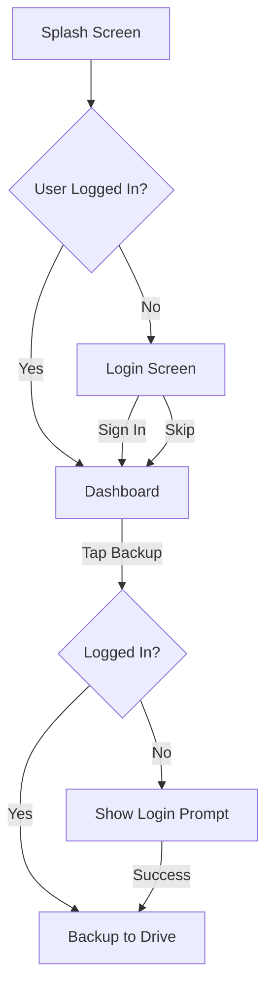

<div align="center">
  
  <h1>💰 Amar Savings</h1>
  <p><strong>Track Physical Cash Savings • Built for Bangladeshi Currency • Offline-First</strong></p>
  
  <p>
    
    
    
    
  </p>
  
  <p>
    
    
    
  </p>
</div>

---

## 📱 About Amar Savings

**Amar Savings** is a simple, elegant, and offline-first personal savings tracker designed specifically for monitoring **physical cash savings** using **Bangladeshi currency notes** (Taka).

> **"Track physical savings with the fewest possible taps."**

Every feature is built around this core principle. No clutter. No complexity. Just a reliable tool that helps you stay on top of your savings goals.

---

## ✨ Key Features

| Feature                         | Description                                                         |
|---------------------------------|---------------------------------------------------------------------|
| 🏦 **Denomination-Based Input** | Add/withdraw cash by entering note quantities (1 to 1000 Taka)      |
| 🎯 **Savings Goal Tracking**    | Set a target amount and watch your progress                         |
| 📊 **Real-Time Dashboard**      | See savings overview, progress, and recent transactions at a glance |
| 🔄 **Offline-First**            | Full functionality without internet connection                      |
| ☁️ **Google Drive Backup**      | Optional cloud backup to keep your data safe                        |
| 📜 **Transaction History**      | View, edit, or delete past entries                                  |
| 🎨 **Adaptive Theme**           | Follows your device's dark/light mode automatically                 |

---

## 🚀 How It Works

### 💸 Adding Savings (Cash In)

1. Tap the **Floating Action Button (FAB)** 
2. Enter quantities for each denomination you're adding
3. Total calculates automatically
4. Tap **"Add"** → Entry saved

**Example:** `5 × ৳1000 + 2 × ৳500 = ৳6,000 added`

### 💰 Withdrawing Savings (Cash Out)

1. **Long-press** the FAB → Select "Cash Out"
2. Enter quantities being removed
3. Tap **"Withdraw"** → Negative entry saved

### 🎯 Setting a Savings Goal

- Tap the **Goal Card** on Dashboard
- Enter your target amount (e.g., ৳100,000)
- Watch progress update in real-time

### ☁️ Backup & Restore

- **Manual Backup:** Tap "Backup Now" on Dashboard (requires Google Sign-In)
- **Automatic Backup:** Happens in background when logged in
- **Restore:** Hidden trigger (5 taps on Backup button) for advanced users

---

## 🗂️ Supported Denomination Notes

<div align="center">

| Denomination |    Input Field    |
|:------------:|:-----------------:|
|    ৳1000     | [Quantity] × 1000 |
|     ৳500     | [Quantity] × 500  |
|     ৳200     | [Quantity] × 200  |
|     ৳100     | [Quantity] × 100  |
|     ৳50      |  [Quantity] × 50  |
|     ৳20      |  [Quantity] × 20  |
|     ৳10      |  [Quantity] × 10  |
|      ৳5      |  [Quantity] × 5   |
|      ৳2      |  [Quantity] × 2   |
|      ৳1      |  [Quantity] × 1   |

</div>

---

## 📱 Screens

### Splash Screen
- Standard Android SplashScreen API
- Dismisses instantly when data is ready
- **No artificial delays**

### Login Screen
- "Sign in with Google" button
- "Skip" option for offline-only use
- Authentication only required for backup

### Dashboard (Main Screen)
- Savings Overview (Current / Goal / Remaining)
- Goal Card (tap to edit)
- Progress Bar
- Cash Analytics (total notes + distribution)
- Backup Section with timestamp
- Recent Transactions (last 5 entries)
- Floating Action Button

### History Screen
- Complete transaction list
- Date & Time • Type • Denomination Breakdown • Total Amount
- Swipe to delete • Tap to edit

---

## 🏗️ Technical Stack

<div align="center">

| Component        | Technology                 |
|------------------|----------------------------|
| **Language**     | Kotlin                     |
| **UI Toolkit**   | Jetpack Compose            |
| **Architecture** | MVVM                       |
| **DI**           | Koin                       |
| **Local DB**     | Room                       |
| **Preferences**  | DataStore                  |
| **Backup**       | Google Drive API + Sign-In |
| **Concurrency**  | Coroutines + Flow          |
| **Navigation**   | Navigation Compose         |

</div>

---

## 🔐 Authentication & Backup Flow



---

## ❌ What's NOT Included (By Design)

- No Settings Screen
- No Theme Selector
- No Activity/Audit Log Tab
- No Goal Deadlines
- No Auto Backup Toggle
- No Manual Dark/Light Mode Switch
- No Edit/Delete tracking in separate log

> **Why?** Amar Savings stays focused on its core purpose: tracking physical savings with minimal friction.

---

## 🚦 Getting Started

### Prerequisites
- Android Studio Hedgehog | 2023.1.1 or later
- JDK 17
- Android SDK API 24+

### Clone & Build

```bash
# Clone the repository
git clone https://github.com/shahjalal-mahmud/amar-savings.git

# Open in Android Studio
cd amar-savings

# Build the project
./gradlew build

# Run on device/emulator
./gradlew installDebug
```

### Google Services Setup (for Backup)

1. Enable **Google Drive API** in Google Cloud Console
2. Create an OAuth 2.0 Client ID for Android
3. Add `google-services.json` to `app/` directory
4. Enable backup in app settings

---

## 📂 Project Structure

```
app/
├── src/main/java/com/amarsavings/
│   ├── ui/              # Compose Screens
│   │   ├── splash/
│   │   ├── login/
│   │   ├── dashboard/
│   │   └── history/
│   ├── data/            # Room DB & Models
│   ├── di/              # Koin Modules
│   ├── backup/          # Google Drive Integration
│   └── utils/           # Helpers & Extensions
```

---

## 🤝 Contributing

Contributions are welcome! Please follow these steps:

1. Fork the repository
2. Create a feature branch (`git checkout -b feature/AmazingFeature`)
3. Commit changes (`git commit -m 'Add AmazingFeature'`)
4. Push to branch (`git push origin feature/AmazingFeature`)
5. Open a Pull Request

---

## 📄 License

This project is licensed under the MIT License - see the [LICENSE](LICENSE) file for details.

---

## 🙏 Acknowledgments

- Built with ❤️ for Bangladesh
- Optimized for Taka currency denominations
- Inspired by the need for simple, offline savings tracking

---

<div align="center">
  <p>Made with <span style="color: red;">❤️</span> for Bangladeshi savers</p>
  <p>
    <a href="https://github.com/yourusername/amar-savings/issues">Report Bug</a> •
    <a href="https://github.com/yourusername/amar-savings/issues">Request Feature</a>
  </p>
  <p>
    
    <strong>সঞ্চয় করুন, স্বাধীন হন</strong>
    <br/>
    <em>Save, Become Independent</em>
  </p>
</div>
```
